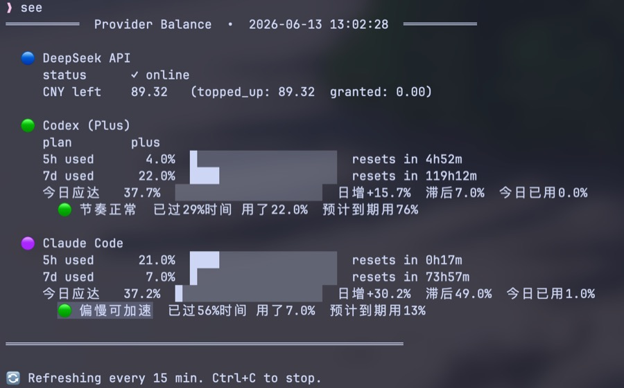

# see-balance

查看 DeepSeek / Codex / Claude Code 三个 AI provider 的余额和用量。

## 安装

```bash
bash install.sh
```

安装做了三件事：
1. 复制 `provider_balance.py` 到 `~/bin/`
2. 创建配置文件 `~/.see-balance.env`（如果不存在）
3. 提示你添加 shell alias

## 配置

编辑 `~/.see-balance.env`：

```bash
DEEPSEEK_API_KEY=sk-your-key-here

# 如需代理（VPN 场景）：
# HTTPS_PROXY=http://127.0.0.1:7890
```

- **DeepSeek key**：[platform.deepseek.com/api_keys](https://platform.deepseek.com/api_keys)
- **Codex**：自动读取 `~/.codex/auth.json`（运行 `codex login` 生成）
- **Claude Code**：自动读取 macOS Keychain（`claude /login` 登录后自动写入）

## 使用

```bash
# 推荐：加 alias 到 ~/.zshrc
alias see="python3 ~/bin/provider_balance.py --watch 15"

see                  # 每 15 分钟刷新
python3 ~/bin/provider_balance.py          # 一次性查询
python3 ~/bin/provider_balance.py --watch 30   # 每 30 分钟
python3 ~/bin/provider_balance.py --compact    # 每 provider 一行
python3 ~/bin/provider_balance.py --json       # 原始 JSON
```

## 输出示例



每个 provider 显示三行进度条：
- **5h used** — 5小时窗口用量
- **7d used** — 7天窗口用量
- **今日应达** — 今日结束时的累计目标（已含亏欠补偿）+ 今日进度
- 节奏评估：🟢 节奏正常 / 🟡 偏快需注意 / 🔴 超速需节约 / 🔴 偏慢可加速

## 状态缓存

用量快照保存在 `~/.see-balance/state.json`，用于显示 DeepSeek 两次查询之间的消费金额。

## 更新

```bash
# 修改源文件后重新安装
cd ~/Dev/tools/see-balance
# 编辑 provider_balance.py
bash install.sh
```
