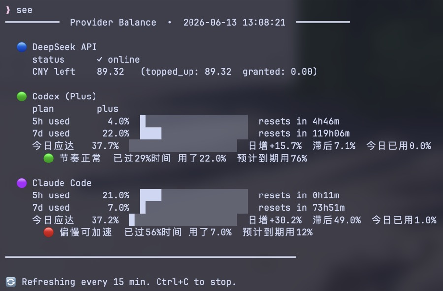

# see-balance

查看 DeepSeek / Codex / Claude Code / Antigravity (AGY) 四个 AI provider 的余额和用量。

## 安装

```bash
bash install.sh
```

安装做了三件事：
1. 复制 `provider_balance.py` 到 `~/bin/`
2. 创建配置文件 `~/.see-balance.env`（如果不存在）
3. 提示你添加 shell alias

## 配置

编辑 `~/.see-balance.env`：

```bash
DEEPSEEK_API_KEY=sk-your-key-here

# 如需代理（VPN 场景）：
# HTTPS_PROXY=http://127.0.0.1:7890
```

- **DeepSeek key**：[platform.deepseek.com/api_keys](https://platform.deepseek.com/api_keys)
- **Codex**：自动读取 `~/.codex/auth.json`（运行 `codex login` 生成）
- **Claude Code**：自动读取 macOS Keychain（`claude /login` 登录后自动写入）
- **Antigravity (AGY)**：自动读取 macOS Keychain / Google OAuth 凭据，识别 `paidTier` 套餐；直连服务端 `retrieveUserQuotaSummary` 读真实配额。

两个互不相通的池，各自带 **5h + weekly** 两个窗口：

| 池 | bucketId | 覆盖 |
|---|---|---|
| Gemini 池 | `gemini-5h` / `gemini-weekly` | Gemini Flash / Pro |
| Claude·GPT 池（3P） | `3p-5h` / `3p-weekly` | Claude Opus / Sonnet / GPT-OSS |

配额单位是 `remainingFraction`（**按 token 成本扣，不是请求次数**）。官方从没公布 5h 的数值阈值，只说过 *"refreshed every five hours until the weekly limit is reached"*。
> ⚠️ 旧版本会把 free-tier 推销文案里的 “1,500 requests/day with Gemini CLI” 当成 AGY 配额 —— 那是 Gemini CLI / Code Assist 的口径，与 Antigravity agent 的配额不是一回事，已在 2026-10-03 修正。本地日志统计的请求数现在单独列为「本地计数」，仅作参考。

## 使用

```bash
# 推荐：加 alias 到 ~/.zshrc
alias see="python3 ~/bin/provider_balance.py --watch 15"

see                  # 每 15 分钟刷新
python3 ~/bin/provider_balance.py          # 一次性查询
python3 ~/bin/provider_balance.py --watch 30   # 每 30 分钟
python3 ~/bin/provider_balance.py --compact    # 每 provider 一行
python3 ~/bin/provider_balance.py --json       # 原始 JSON
```

## 输出示例



每个 provider 显示进度条与节奏分析：
- **5h used / 7d used** — 各窗口用量（AGY 按池分开显示 G-5h / G-7d / 3P-5h / 3P-7d）
- **进度应达** — 线性时间进度应达百分比 + 当前进度超前/还差评估
- **节奏评估** — 🟢 节奏正常 / 🟡 偏快需注意 / 🔴 超速需节约 / 🔴 偏慢可加速（附已过时间、当前消耗与到期预计）
- **实测消耗** — 从历史快照算出的真实速率：`+1.4%/h`（额度窗口）或 `¥0.69/h`（DeepSeek 现金）
- **建议** — 把速率翻译成结论：**能不能撑到重置**（`⚠ 2.6h 后见底，比重置早 56h`）或在闸门内（`今日将花 ¥13.52（闸门 ¥9.00 ⚠ 会超）`）
- **增量消费** — 两次查询之间的新增消费

`--compact` 每行末尾会带速率后缀：`⇣+1.4%/h≈3h`（按此速率还有 3h 见底）。

## 状态缓存

用量快照保存在 `~/.see-balance/state.json`，用途：
- `history` 数组：每次查询追一条样本（保留 14 天 / 4000 条），**实测消耗速率就从这里算** —— 跨重启、跨终端都不断（重启进程不会丢速率）。
- `daily_baselines`：当天开头各窗口的基线，用于算「进度应达」。

可用环境变量：

| 变量 | 作用 |
|---|---|
| `SEE_BALANCE_STATE` | 换一个 state 文件（测试 / 多账号） |
| `SEE_BALANCE_CNY_DAILY_CAP` | DeepSeek 当日人民币闸门（例 `9`），设了就会给「安全 / 会超」判定 |
| `HTTPS_PROXY` | 访问 api.deepseek.com / chatgpt.com 的代理 |

速率的可信度取决于采样密度：`--watch 15` 下几小时内就很准；只跑两次相隔 1 分钟是看不到速率的（跨度 < 3 分钟直接不出值，避免噪声）。

## 更新

```bash
# 修改源文件后重新安装
cd ~/Dev/tools/see-balance
# 编辑 provider_balance.py
bash install.sh
```
